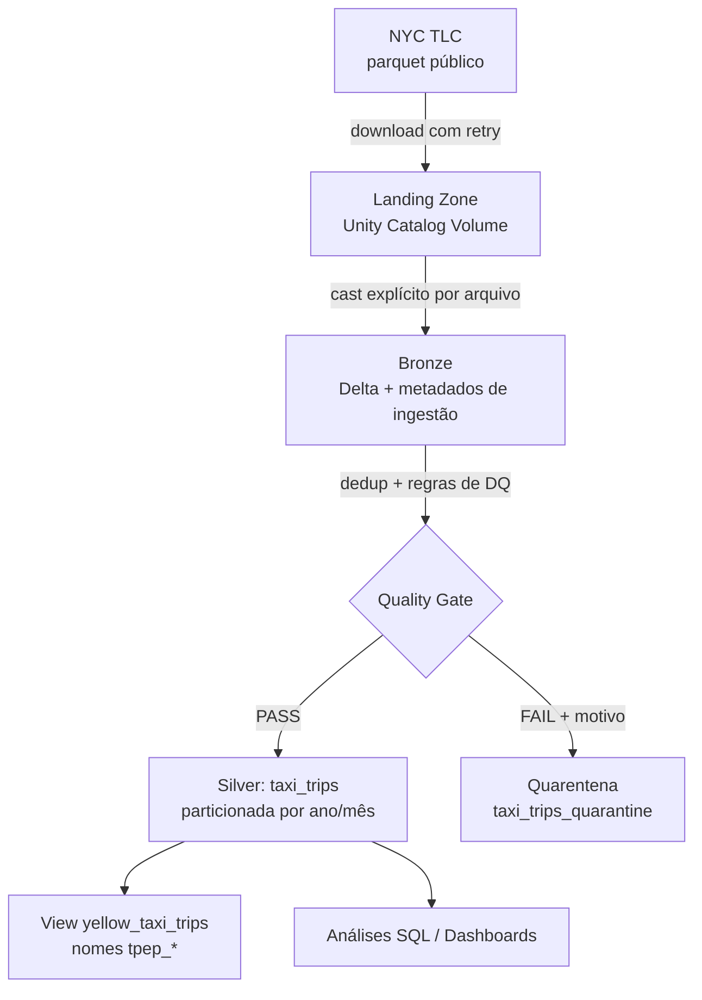

# Case Técnico Data Architect — iFood


## Visão Geral da Solução

Pipeline de ingestão, tratamento e disponibilização dos dados de corridas de
táxi de Nova York (Jan–Mai/2023), com arquitetura **medallion** sobre
**Databricks Free Edition** e **Unity Catalog**, código estruturado como
pacote Python testável e **quarentena de data quality** para auditabilidade.



## Arquitetura e Decisões Técnicas

| Decisão | Justificativa |
|---|---|
| **Databricks Free Edition + Unity Catalog** | Unity Catalog resolve a exigência de "tecnologia de metadados" com governança, lineage automático e catálogo self-service; Free Edition torna a solução 100% reproduzível pelo avaliador, sem custo nem credenciais externas |
| **UC Volume como landing zone** | Equivalente a um bucket S3, com storage gerenciado pelo catálogo (montado via FUSE, manipulável com Python padrão) |
| **Delta Lake em todas as camadas** | ACID, schema enforcement, time travel |
| **Código como pacote Python (`src/`)** | Jobs como classes com responsabilidade única, lógica de qualidade como funções puras testáveis, configuração externalizada em YAML; notebooks são cascas finas de orquestração |
| **Quarentena de DQ (em vez de descartar)** | Cada registro reprovado é preservado com o motivo exato da falha — auditabilidade, observabilidade por regra e possibilidade de reprocessamento |
| **Silver particionada por `pickup_year, pickup_month`** | Alinhada ao padrão de consulta das perguntas do case (agregação mensal na Q1, filtro de maio na Q2 → partition pruning) |
| **Yellow + green unificados** | A pergunta 2 pede "todos os táxis da frota"; colunas `lpep_*`/`tpep_*` são canonizadas para `pickup_datetime`/`dropoff_datetime`, com `taxi_type` identificando a origem |
| **Cast explícito por arquivo na bronze** | Os parquets de 2023 têm **schema drift entre meses** (`passenger_count` ora int64, ora double); o cast deliberado evita depender de coerção implícita no union |

## Qualidade dos Dados (padrão de quarentena)

Na transição bronze → silver, cada registro é avaliado contra as regras
abaixo. Aprovados vão para `silver.taxi_trips`; reprovados vão para
`silver.taxi_trips_quarantine` com a lista dos motivos de falha.

| Regra | Motivo registrado | Justificativa |
|---|---|---|
| `total_amount` nulo ou ≤ 0 | `null_total_amount` / `non_positive_total_amount` | Estornos/ajustes, não corridas efetivas |
| `passenger_count` ≤ 0 | `non_positive_passenger_count` | Contagem inválida. **NULL é tolerado** (campo não preenchido pelo taxímetro é comum na fonte e não invalida a corrida para análises de receita; análises de passageiros filtram NULL na query) |
| Datas nulas | `null_pickup_datetime` / `null_dropoff_datetime` | Erro de registro na fonte |
| `dropoff ≤ pickup` | `non_positive_trip_duration` | Duração inválida |
| Duração > 24h | `trip_duration_too_long` | Outlier fisicamente implausível |
| Pickup fora de Jan–Mai/2023 | `pickup_before_range` / `pickup_after_range` | Os arquivos mensais da TLC contêm registros residuais de outros períodos |

Além das regras acima, registros duplicados pela chave de negócio
(`VendorID + pickup + dropoff + passenger_count + total_amount + taxi_type`)
são deduplicados antes da avaliação.

**Resultado da execução (preencher com os números da rodada final):**

| Tabela | Total de linhas |
|---|---|
| bronze_yellow | 16.186.386 |
| bronze_green | 339.630 |
| silver.taxi_trips (PASS) | *(preencher após rodar com quarentena)* |
| silver.taxi_trips_quarantine (FAIL) | *(preencher)* |

Auditoria por motivo de falha disponível em:
```sql
SELECT dq_failures, COUNT(*) FROM ifood_case.silver.taxi_trips_quarantine
GROUP BY dq_failures ORDER BY 2 DESC;
```

## Dicionário de Dados — `silver.taxi_trips`

| Coluna | Tipo | Descrição |
|---|---|---|
| `VendorID` | INT | Provedor de tecnologia da corrida (1 = CMT, 2 = VeriFone) |
| `passenger_count` | INT | Número de passageiros (informado pelo motorista; pode ser NULL) |
| `total_amount` | DOUBLE | Valor total cobrado do passageiro (USD) |
| `pickup_datetime` | TIMESTAMP | Início da corrida (canonizado de `tpep_`/`lpep_pickup_datetime`) |
| `dropoff_datetime` | TIMESTAMP | Fim da corrida (canonizado de `tpep_`/`lpep_dropoff_datetime`) |
| `taxi_type` | STRING | Origem do registro: `yellow` ou `green` |
| `pickup_year` | INT | Ano do embarque (**coluna de partição**) |
| `pickup_month` | INT | Mês do embarque (**coluna de partição**) |

A view `silver.yellow_taxi_trips` expõe apenas os yellow taxis com os nomes
originais `tpep_*`, atendendo literalmente à exigência do enunciado.

## Estrutura do Repositório

```
ifood-case/
├─ src/
│  ├─ jobs/
│  │  ├─ extract.py          # ExtractJob: download TLC → landing (retry + chunks)
│  │  ├─ bronze.py           # BronzeJob: cast explícito por arquivo + union
│  │  └─ silver.py           # SilverJob: dedup + quarentena + particionamento + view
│  ├─ utils/
│  │  ├─ data_quality.py     # regras de DQ como funções puras (testáveis)
│  │  └─ schemas.py          # schema alvo (resolve o schema drift)
│  ├─ config.py              # loader do YAML + helper de nomes de tabela
│  ├─ config.yaml            # catálogo, período, tipos de táxi, regras, download
│  └─ main.py                # CLI: python -m src.main <extract|bronze|silver|all>
├─ notebooks/                # cascas finas que importam e executam os jobs
├─ analysis/                 # EDA + respostas Q1/Q2 com visualizações
├─ tests/
│  ├─ conftest.py            # SparkSession local
│  └─ utils/                 # testes de DQ (14 casos) e de schema drift
├─ .github/workflows/ci.yml  # flake8 + pytest a cada push
├─ README.md
├─ requirements.txt          # runtime Databricks (requests, pyyaml)
└─ requirements-dev.txt      # desenvolvimento local e CI (pyspark, pytest, flake8)
```

## Como Executar

### No Databricks (pipeline completo)
1. Criar conta no [Databricks Free Edition](https://www.databricks.com/learn/free-edition)
2. Conectar este repositório como **Git Folder**
3. Rodar `notebooks/00_setup` (catálogo, schemas e volume)
4. Rodar os notebooks `01_extract` → `02_bronze` → `03_silver` (cada um só
   importa e executa a classe correspondente de `src/`)
5. Rodar os notebooks de `analysis/`

### Testes e lint (local ou CI)
```bash
pip install -r requirements-dev.txt
flake8 src tests
pytest -q        # 14 testes: regras de DQ, quarentena e schema drift
```
O GitHub Actions executa lint + testes a cada push (badge no topo).

## Resultados

### Pergunta 1 — Média de `total_amount` por mês (yellow taxis)
Duas leituras calculadas (queries em `analysis/q1_media_total_amount`):
média por corrida mês a mês (principal) e receita média mensal da frota
(alternativa). *(Preencher com os números da execução final.)*

### Pergunta 2 — Média de passageiros por hora do dia em maio (todos os táxis)
A média de passageiros por corrida em maio/2023 seguiu um padrão claro ao
longo do dia: os valores mais altos ocorrem na madrugada (0h–3h) e à noite
(20h–23h), em torno de 1,45 passageiros por corrida — coerente com
deslocamentos em grupo após eventos sociais. O menor valor acontece por
volta das 6h (~1,26), quando as corridas tendem a ser individuais. Ao longo
do dia comercial (7h–19h), a média se mantém entre 1,35 e 1,40.

## Evolução para Produção

**1. Landing zone em S3 dedicado**, com acesso via **IAM Role** (nunca
chaves hardcoded), com política de menor privilégio:

```json
{
  "Version": "2012-10-17",
  "Statement": [{
    "Effect": "Allow",
    "Action": ["s3:GetObject", "s3:PutObject", "s3:ListBucket"],
    "Resource": [
      "arn:aws:s3:::ifood-taxi-landing",
      "arn:aws:s3:::ifood-taxi-landing/*"
    ]
  }]
}
```

**2. Bucket registrado como External Location no Unity Catalog**, mantendo
governança e lineage sobre o dado externo.

**3. Ingestão incremental com Auto Loader** (notificação S3 → SQS) em vez de
backfill, com checkpointing para exactly-once.

**4. Orquestração** via Databricks Workflows ou Airflow, agendada à cadência
de publicação da TLC (defasagem ~2 meses), com alertas de falha.

**5. Expectativas de qualidade como código** (DLT expectations ou Great
Expectations) evoluindo o módulo `data_quality.py` atual, com métricas de
quarentena monitoradas ao longo do tempo (% de falha por regra como sinal de
regressão na fonte).

**Por que não implementamos S3 no case:** o escopo é resolvido de forma
completa e nativa com Unity Catalog Volumes, sem credenciais de nuvem
externas — reduzindo superfície de risco e mantendo o foco em modelagem,
qualidade e engenharia de dados.
