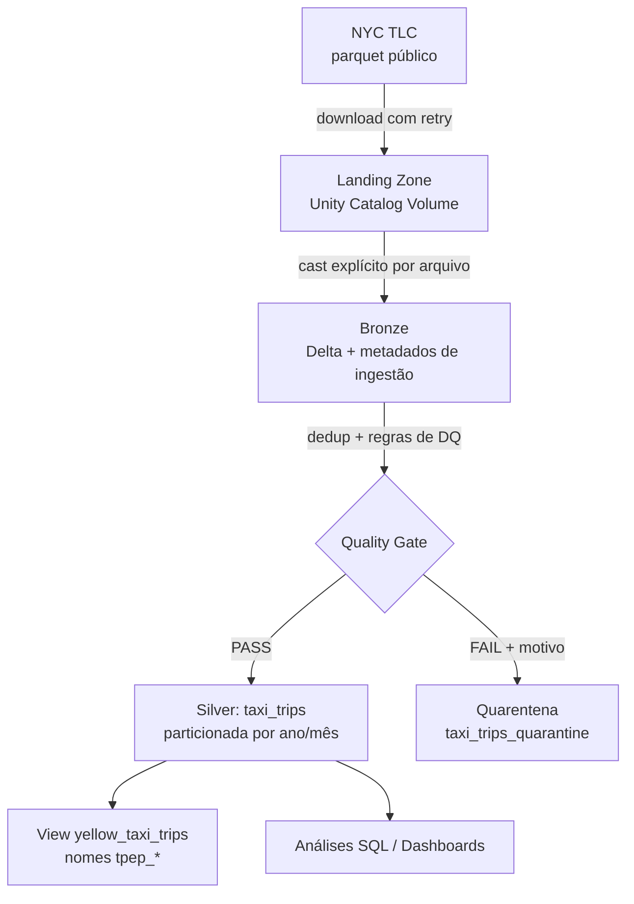

# Case Técnico Data Architect — iFood


## Visão Geral da Solução

Este repositório resolve o case de ingestão, tratamento e disponibilização
dos dados de corridas de táxi de Nova York (Jan–Mai/2023). Segui uma
arquitetura medallion clássica rodando em Databricks Free Edition com Unity
Catalog, escrevi o pipeline como um pacote Python testável em vez de
notebooks soltos, e adicionei uma camada de quarentena para os dados que não
passam nas regras de qualidade — mais detalhes sobre essa escolha na seção
abaixo.



## Arquitetura e Decisões Técnicas

| Decisão | Por que fiz assim |
|---|---|
| **Databricks Free Edition + Unity Catalog** | O Unity Catalog já cobre a exigência de escolher uma "tecnologia de metadados" — ganho governança, lineage automático e um catálogo navegável de graça. O Free Edition, por sua vez, deixa a solução reproduzível por qualquer pessoa sem custo e sem precisar de credencial de nuvem nenhuma |
| **Volume do UC como landing zone** | Faz o mesmo papel que um bucket S3 faria, mas com storage gerenciado pelo próprio catálogo (é montado via FUSE, então dá pra mexer nele com Python padrão) |
| **Delta Lake em todas as camadas** | ACID, schema enforcement e time travel de graça |
| **Código como pacote Python em `src/`** | Preferi jobs como classes com responsabilidade única e a lógica de qualidade como funções puras, testáveis fora do Databricks. Os notebooks viraram só orquestração — quem quiser entender a lógica de verdade vai em `src/` |
| **Quarentena em vez de descartar** | Cada registro reprovado é guardado com o motivo exato da falha, em vez de simplesmente sumir. Dá pra auditar quanto cada regra está pegando e reprocessar se precisar |
| **Silver particionada por `pickup_year, pickup_month`** | Pensei no padrão de consulta das próprias perguntas do case: a Q1 agrega por mês e a Q2 filtra maio, então as duas se beneficiam de partition pruning |
| **Yellow + green unificados** | A pergunta 2 pede "todos os táxis da frota", então deixar o green de fora seria responder a pergunta errada. Canonizei `lpep_*`/`tpep_*` para `pickup_datetime`/`dropoff_datetime` e guardei a origem em `taxi_type` |
| **Cast explícito por arquivo na bronze** | Os parquets de 2023 têm schema drift entre meses — `passenger_count` varia entre int64 e double dependendo do mês. Cast deliberado evita depender de coerção implícita no union |

## Qualidade dos Dados (padrão de quarentena)

Na passagem de bronze para silver, cada registro passa pelas regras abaixo.
Quem passa vai para `silver.taxi_trips`; quem não passa vai para
`silver.taxi_trips_quarantine`, junto com a lista dos motivos da reprovação.

| Regra | Motivo registrado | Por quê |
|---|---|---|
| `total_amount` nulo ou ≤ 0 | `null_total_amount` / `non_positive_total_amount` | São estornos ou ajustes administrativos, não corridas de fato |
| `passenger_count` ≤ 0 | `non_positive_passenger_count` | Contagem sem sentido físico. **NULL passa** — é comum o taxímetro não preencher o campo, e isso não invalida a corrida para quem analisa receita; quem precisa de passageiros filtra o NULL na própria query |
| Datas nulas | `null_pickup_datetime` / `null_dropoff_datetime` | Erro de registro na fonte |
| `dropoff ≤ pickup` | `non_positive_trip_duration` | Duração que não existe |
| Duração > 24h | `trip_duration_too_long` | Fisicamente implausível para uma corrida de táxi |
| Pickup fora de Jan–Mai/2023 | `pickup_before_range` / `pickup_after_range` | Os arquivos mensais da TLC trazem registros residuais de outros períodos |

Antes de tudo isso, também deduplico pela chave de negócio
(`VendorID + pickup + dropoff + passenger_count + total_amount + taxi_type`)
— duplicata é problema de identidade, não de qualidade do conteúdo, então
não faz sentido misturar as duas coisas.

**Números da execução:**

| Tabela | Total de linhas |
|---|---|
| bronze_yellow | 16.186.386 |
| bronze_green | 339.630 |
| **soma bronze** | **16.526.016** |
| deduplicados (unificado, antes do DQ) | 16.525.878 (138 duplicatas removidas) |
| silver.taxi_trips (aprovados) | 16.098.785 |
| silver.taxi_trips_quarantine (reprovados) | 427.093 (aprox. 2,59% do total) |
| silver.yellow_taxi_trips (view, só yellow aprovados) | 15.763.248 |

**Quantos registros cada regra pegou** (somando os casos em que um registro
falhou em mais de uma regra ao mesmo tempo):

| Motivo | Registros | % da quarentena |
|---|---|---|
| `non_positive_passenger_count` | 275.888 | 64,6% |
| `non_positive_total_amount` | 145.444 | 34,1% |
| `non_positive_trip_duration` | 6.596 | 1,5% |
| `trip_duration_too_long` | 94 | 0,02% |
| `pickup_before_range` | 72 | 0,02% |
| `pickup_after_range` | 41 | 0,01% |

Quase 99% das reprovações vêm de só duas regras — `passenger_count`
inválido e `total_amount` não positivo. Isso sugere que o problema de
qualidade na fonte da TLC está concentrado em campos específicos, não
espalhado aleatoriamente pelos dados. Os filtros de data e duração, embora
necessários (o achado da EDA sobre registros de anos completamente fora de
escopo mostra isso), pegam uma fração bem menor.

Query usada pra chegar nesses números:
```sql
SELECT dq_failures, COUNT(*) FROM ifood_case.silver.taxi_trips_quarantine
GROUP BY dq_failures ORDER BY 2 DESC;
```

## Dicionário de Dados — `silver.taxi_trips`

| Coluna | Tipo | Descrição |
|---|---|---|
| `VendorID` | INT | Provedor de tecnologia da corrida (1 = CMT, 2 = VeriFone) |
| `passenger_count` | INT | Número de passageiros (informado pelo motorista; pode ser NULL) |
| `total_amount` | DOUBLE | Valor total cobrado do passageiro (USD) |
| `pickup_datetime` | TIMESTAMP | Início da corrida (canonizado de `tpep_`/`lpep_pickup_datetime`) |
| `dropoff_datetime` | TIMESTAMP | Fim da corrida (canonizado de `tpep_`/`lpep_dropoff_datetime`) |
| `taxi_type` | STRING | Origem do registro: `yellow` ou `green` |
| `pickup_year` | INT | Ano do embarque (coluna de partição) |
| `pickup_month` | INT | Mês do embarque (coluna de partição) |

Quem quiser só os yellow taxis com os nomes de coluna originais do
enunciado (`tpep_pickup_datetime`, `tpep_dropoff_datetime`) pode usar a view
`silver.yellow_taxi_trips` — ela existe justamente pra isso.

## Estrutura do Repositório

```
ifood-case/
├─ .github/
│  └─ workflows/
│     └─ ci.yml               # roda flake8 + pytest a cada push
├─ src/
│  ├─ jobs/
│  │  ├─ extract.py           # ExtractJob: download TLC → landing (retry + chunks)
│  │  ├─ bronze.py            # BronzeJob: cast explícito por arquivo + union
│  │  └─ silver.py            # SilverJob: dedup + quarentena + particionamento + view
│  ├─ utils/
│  │  ├─ data_quality.py      # regras de DQ como funções puras (testáveis)
│  │  └─ schemas.py           # schema alvo (resolve o schema drift)
│  ├─ config.py               # loader do YAML + helper de nomes de tabela
│  ├─ config.yaml             # catálogo, período, tipos de táxi, regras, download
│  └─ main.py                 # CLI: python -m src.main <extract|bronze|silver|all>
├─ notebooks/
│  ├─ 00_setup.py             # cria catálogo, schemas e volume no Unity Catalog
│  ├─ 01_extract.py           # chama ExtractJob
│  ├─ 02_bronze.py            # chama BronzeJob
│  └─ 03_silver.py            # chama SilverJob + validação de volumetria e quarentena
├─ analysis/
│  ├─ exploratory_analysis.py       # EDA da camada bronze
│  ├─ q1_media_total_amount.py      # resposta da pergunta 1
│  └─ q2_media_passageiros_hora_maio.py  # resposta da pergunta 2
├─ tests/
│  ├─ conftest.py             # fixture de SparkSession local
│  └─ utils/
│     ├─ test_data_quality.py # 11 cenários de DQ + quarentena (parametrizados)
│     └─ test_schemas.py      # teste do schema drift (VendorID/passenger_count)
├─ README.md
├─ requirements.txt           # runtime Databricks (requests, pyyaml)
├─ requirements-dev.txt       # desenvolvimento local e CI (pyspark, pytest, flake8)
├─ pytest.ini                 # aponta o pytest para a pasta tests/
└─ setup.cfg                  # configuração do flake8
```

## Como Executar

### No Databricks (pipeline completo)
1. Criar conta no [Databricks Free Edition](https://www.databricks.com/learn/free-edition)
2. Conectar este repositório como **Git Folder**
3. Rodar `notebooks/00_setup` (catálogo, schemas e volume)
4. Rodar os notebooks `01_extract` → `02_bronze` → `03_silver` (cada um só
   importa e executa a classe correspondente de `src/`)
5. Rodar os notebooks de `analysis/`

### Testes e lint (local ou CI)
```bash
pip install -r requirements-dev.txt
flake8 src tests
pytest -q        # 14 testes: regras de DQ, quarentena e schema drift
```
O GitHub Actions roda lint + testes a cada push (badge lá em cima).

## Resultados

### Pergunta 1 — Média de `total_amount` por mês (yellow taxis)

| Mês | Média `total_amount` | Qtd. corridas |
|---|---|---|
| Jan/2023 | US$ 27,50 | 2.988.829 |
| Fev/2023 | US$ 27,39 | 2.840.168 |
| Mar/2023 | US$ 28,32 | 3.313.632 |
| Abr/2023 | US$ 28,82 | 3.199.973 |
| Mai/2023 | US$ 29,53 | 3.420.646 |

A média por corrida vai de US$ 27,39 em fevereiro (o mês mais baixo) até
US$ 29,53 em maio (o mais alto), com uma tendência de alta praticamente
constante — só fevereiro quebra a sequência com uma leve queda frente a
janeiro, o que faz sentido considerando que é o mês mais curto. De março a
maio o crescimento é bem consistente, chegando a uma alta acumulada de
aproximadamente 4,3%. Pela leitura alternativa (receita total agregada por
mês), a média mensal da frota fica em **US$ 89.419.184,41**.

Consulta completa em `analysis/q1_media_total_amount.py`.

### Pergunta 2 — Média de passageiros por hora do dia em maio (todos os táxis)

O padrão ao longo do dia é bem intuitivo: a média sobe na madrugada (0h–3h,
por volta de 1,45 passageiros) e de novo à noite (20h–23h) — provavelmente
gente voltando em grupo de algum compromisso social. O ponto mais baixo é
por volta das 6h da manhã (aprox. 1,26), coerente com quem está indo sozinho
para o trabalho. No horário comercial (7h–19h) a média fica estável, entre
1,35 e 1,40.

## Evolução para Produção

Aqui vai como eu evoluiria essa solução se fosse para um ambiente produtivo
de verdade, e não só para o case:

**1. Landing zone em S3 dedicado**, com acesso via IAM Role — nunca chave
hardcoded — e política de menor privilégio:

```json
{
  "Version": "2012-10-17",
  "Statement": [{
    "Effect": "Allow",
    "Action": ["s3:GetObject", "s3:PutObject", "s3:ListBucket"],
    "Resource": [
      "arn:aws:s3:::ifood-taxi-landing",
      "arn:aws:s3:::ifood-taxi-landing/*"
    ]
  }]
}
```

**2. Bucket registrado como External Location no Unity Catalog**, para não
perder governança e lineage mesmo com o dado morando fora do storage
gerenciado.

**3. Ingestão incremental com Auto Loader** (notificação S3 → SQS) no lugar
do backfill que fiz aqui, com checkpoint garantindo exactly-once.

**4. Orquestração** via Databricks Workflows ou Airflow, agendada de acordo
com a cadência real de publicação da TLC (que tem uma defasagem de
aproximadamente 2 meses), com alerta configurado para falha.

**5. Expectativas de qualidade como código** (DLT expectations ou Great
Expectations), evoluindo o módulo `data_quality.py` que já existe, com as
métricas de quarentena monitoradas ao longo do tempo — a taxa de falha por
regra funcionando como sinal de alerta se a fonte começar a piorar.

Não implementei o S3 de fato neste case porque o escopo pedido já é
resolvido de forma completa com Unity Catalog Volumes, sem precisar de
nenhuma credencial de nuvem externa. Isso reduz a superfície de risco do
repositório (nada de chave vazando em commit público) e deixa o foco onde
o case realmente cobra: modelagem, qualidade e engenharia de dados.
